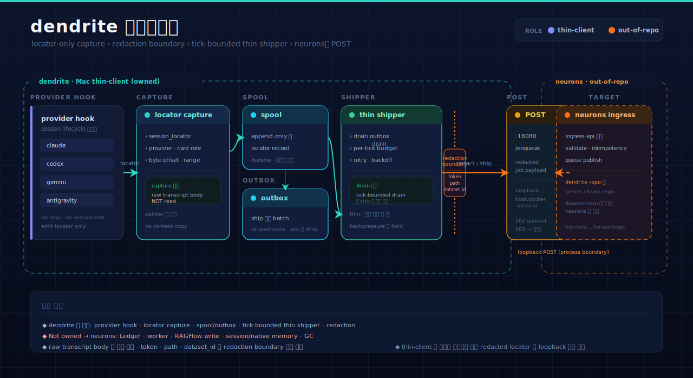

<!-- ──────────────── HERO BANNER ──────────────── -->
<div align="center">


<br/>

<!-- Project badges -->


<br/><br/>

<!-- Tagline -->
<h3>
  <code>dendrite</code>는 LLM-brain의 <b>Mac thin-client</b>다.<br/>
  provider hook · locator-only capture · spool/outbox · thin shipper로<br/>
  redacted enqueue payload를 만들어 <code>neurons</code> ingress(<code>POST 18080</code>)로 보낸다.<br/>
  server/brain/GC 권위는 갖지 않는다.
</h3>

<br/>

<!-- Tech stack -->
<p>
  
  
  
  
</p>

<br/>

<!-- Quick navigation -->
<p>
  <a href="#dendrite-boundary"></a>
  <a href="#-파이프라인"></a>
  <a href="#-cli-command-surface"></a>
  <a href="#-빠른-시작"></a>
</p>

</div>

<br/>

## Dendrite Boundary

`dendrite`는 LLM-brain/neurons로 transcript locator와 redacted enqueue payload를
전달하는 Mac thin-client 저장소다. 역사적 `workspace-ragflow-advisor`의
provider/capture 지침 중 **client 책임만** 가져온다. server/brain/GC 권위는
`neurons`가 소유한다.

Owned here:

- provider hook payload normalization (claude · codex · gemini · antigravity)
- locator-only local capture/spool/outbox
- bounded thin shipper enqueue to `POST 18080`
- public/redacted enqueue payload contract
- local-only diagnostics and dry-run hook plans
- `agy-headless-capture` launch-dir label plus transcript locator capture
- local `SourceRef` catalog (public metadata + private same-device index)

Not owned here (→ `neurons`):

- `Ledger` / `TranscriptIngestWorker` ownership
- direct RAGFlow write/delete/disable, RAGFlow API credential handling
- session-memory build/promote/read SoT
- brain.query, MemoryCard, native memory
- GC live execute or GC scheduler wiring
- Ubuntu runtime mutation, Docker/RAGFlow management, `ssh ragflow-ubuntu`

provider hook은 locator-only를 유지한다 — private spool request를 쓰고 shipper를
깨울 수 있지만 RAGFlow·NATS·Docker·SSH·GC를 호출하지 않는다. `RAGFLOW_API_KEY`는
server/runtime lane의 것이며 `dendrite`의 것이 아니다.

`tests/test_client_boundary.py`가 historical `agent_knowledge` source monolith와
server/brain authority symbol의 import를 거부해 이 경계를 가드하고,
`tests/test_repo_instructions.py`가 thin-client boundary 문자열을 가드한다.

<!-- ────────────── SECTION DIVIDER ────────────── -->


<br/>

## 🛰️ 파이프라인

> provider hook이 만든 locator를 **redacted payload**로 묶어 bounded tick으로 `neurons`에 보낸다.
> raw transcript 본문은 읽지 않고, token·path·dataset_id는 redaction boundary에서 차단된다.

<p align="center">
  
</p>

<br/>

### 🎨 핵심 설계 포인트

<table>
<tr>
<td width="50%" valign="top">

#### 🟦 Locator-only capture

provider hook payload에서 **locator만** 뽑아 spool한다.<br/>
raw transcript body는 읽지도 옮기지도 않는다. 본문 권위는
`neurons`가 source(CouchDB)에서 재해석한다.

</td>
<td width="50%" valign="top">

#### 🟪 Redaction boundary

`POST 18080` 직전에 token·private path·`dataset_id`·
`document_id`·transcript body를 차단한다.<br/>
public/redacted enqueue payload만 wire에 올린다.

</td>
</tr>
<tr>
<td width="50%" valign="top">

#### 🟩 Bounded thin shipper

`transcript-drain`이 spool을 **tick 단위 bounded**로 읽어
ingress queue로 전달한다.<br/>
한 번에 큐를 쏟지 않고, 백프레셔를 client 쪽에서 존중한다.

</td>
<td width="50%" valign="top">

#### 🟧 Spool / outbox durability

capture는 먼저 로컬 spool에 durable하게 쌓이고,<br/>
shipper가 best-effort로 비운다. 전송 실패는 local outbox에
남아 재시도되며 client가 server 상태를 떠안지 않는다.

</td>
</tr>
</table>

<br/>


<br/>

## 🧰 CLI command surface

`transcript_ingest.py`는 thin enqueue body/client seam만 담는다. server worker,
ledger/state authority, direct RAGFlow writer, session-memory build/promote, brain
query, native memory, GC safety는 `neurons` 책임이다.

<table>
<thead>
<tr><th>command</th><th>역할</th></tr>
</thead>
<tbody>
<tr><td><code>dendrite transcript-capture</code></td><td>provider hook payload를 locator-only capture request로 spool. <code>--kickstart-label</code>은 spool 이후 thin shipper LaunchAgent를 best-effort로 깨우는 선택 옵션.</td></tr>
<tr><td><code>dendrite transcript-drain</code></td><td>capture spool의 locator request를 bounded tick으로 읽어 redacted enqueue payload를 <code>POST 18080</code> ingress queue로 전달.</td></tr>
<tr><td><code>dendrite transcript-migrate</code></td><td>모든 historical provider session에 대해 locator-only capture request를 bulk-spool. <code>--dry-run</code>은 enumerate/count만, <code>--provider</code>/<code>--limit</code>로 범위 제한. authority는 neurons가 재해석.</td></tr>
<tr><td><code>dendrite capture-fixture</code> · <code>dendrite capture</code></td><td>JSON fixture / stdin JSON을 minimized local event로 spool.</td></tr>
<tr><td><code>dendrite source-catalog scan</code></td><td>public <code>SourceRef</code> metadata와 private local index를 작성(<code>--sync-policy</code> 기본 metadata_only).</td></tr>
<tr><td><code>dendrite source-catalog resolve</code></td><td>private <b>same-device</b> index에서 <code>SourceRef</code>를 해석. <code>--approval-ref</code>·<code>--expected-content-hash</code>·<code>--max-bytes</code>로 게이트.</td></tr>
<tr><td><code>dendrite provider doctor</code></td><td>provider source contract readiness 확인.</td></tr>
<tr><td><code>dendrite provider hook-plan</code></td><td>non-mutating provider hook plan 출력.</td></tr>
<tr><td><code>agy-headless-capture</code></td><td>headless Antigravity run 실행 후 launch-dir label과 transcript locator만 capture spool에 기록.</td></tr>
</tbody>
</table>

> 🔐 **same-device 원칙.** `source-catalog resolve`는 private index가 만들어진 **같은 기기**에서만
> 동작하고, raw 본문은 `--max-bytes`(기본 4096) 한도와 approval 게이트 안에서만 노출된다.
> private path·token·raw `dataset_id`/`document_id`는 public 출력에 쓰지 않는다.

<br/>

### 🔌 Providers

<p>
  
  
  
  
  
</p>

각 provider hook은 자기 payload를 normalize해 동일한 locator-only capture request로 모은다.
hook은 RAGFlow·NATS·Docker·SSH·GC를 호출하지 않는다.

`hermes`는 세션을 단일 SQLite store(`~/.hermes/state.db`)에 보관하므로 **locator
pointer provider**로 통합된다. dendrite는 그 store를 열거나 파싱하지 않고 locator와
안전 metadata만 ship하며, 세션 본문 추출은 `neurons`가 맡는다.
자세한 enable 방법·안전 경계·샘플 설정은 [`docs/HERMES_PROVIDER.md`](docs/HERMES_PROVIDER.md).

<br/>


<br/>

## 🚀 빠른 시작

```bash
# 테스트 (client boundary + repo instruction 가드 포함)
uv run pytest -q

# CLI 표면 확인
uv run python -m dendrite --help

# headless Antigravity capture (launch-dir label + locator만 기록)
# 인자는 agy CLI로 그대로 forward됨 (--print 등은 upstream agy 측 플래그)
uv run agy-headless-capture --print "your prompt"
```

이 저장소는 Mac thin-client seam을 이미 로컬로 보유한다. capture는 먼저 로컬 spool에
쌓이고, `transcript-drain`이 bounded tick으로 비워 `neurons` ingress로 보낸다.

> 📖 server/brain 측 계약과 plane 구성은 [`neurons` README](https://github.com/pureliture/neurons)를 본다.
> `dendrite`는 그 ingress lane의 **client 끝단**만 책임진다.

<br/>


