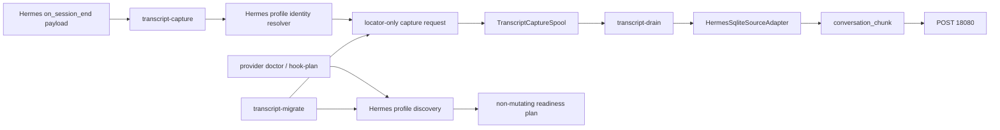

# Hermes Session Capture Reliability Design Spec

## Overview

Hermes provider capture를 모든 Hermes profile에 대해 profile-aware하게 만든다.
`dendrite`는 profile별 source/session/agent identity를 분리하고, config mutation이나
대량 live backfill은 하지 않는 Mac thin-client 경계를 유지한다.

## Approval Status

- Requirements source: `requirements.md`
- Design status: approved by prior user instruction
- Preview companion: 생성하지 않음. Markdown만으로 검토 가능.

## Requirements Reference

핵심 요구사항은 다음이다.

- default 및 모든 named Hermes profile을 발견/진단한다.
- 같은 `provider=hermes` 아래에서도 profile별 source/session/agent identity를 분리한다.
- `session_id_hash`는 Hermes profile boundary를 반영한다.
- drain metadata의 `agent_id`는 `hermes-<profile>-transcript-capture` 형태로 분리한다.
- hook config 수정은 하지 않고 non-mutating plan only로 둔다.
- `project`는 `cwd`/`workspacePaths`에서 추론하고, profile은 별도 metadata로 보존한다.
- backfill은 profile별 dry-run과 bounded smoke만 지원한다.

## Approach Proposal

선택한 접근: **profile identity context를 capture request에 저장하고 downstream에서 재사용한다.**

- 장점: 기존 spool/drain 흐름을 유지하면서 hash, metadata, report가 같은 source를 공유한다.
- 장점: provider 전체를 쪼개지 않고 `provider=hermes` compatibility를 유지한다.
- 단점: capture request schema에 Hermes-specific public-safe metadata가 추가된다.

대안 1: Hermes profile을 별도 provider처럼 `hermes-metis`로 분리한다.

- 장점: 기존 provider별 aggregate가 자연스럽다.
- 단점: provider contract와 CLI choices가 폭발하고, `provider=hermes` 호환성이 깨진다.

대안 2: drain 단계에서 locator path로 profile을 재추론한다.

- 장점: capture request 변경이 적다.
- 단점: private path 추론에 의존해 testability와 privacy boundary가 약해진다.

## Architecture

## Data Flow

1. Hermes hook payload가 `transcript-capture --provider hermes`로 들어온다.
2. capture는 explicit locator 또는 `HERMES_HOME`/default path에서 `state.db`를 locator-only로 찾는다.
3. capture는 locator path와 payload metadata에서 `hermes_profile`을 public-safe slug로 결정한다.
4. capture request는 `provider=hermes`, `project`, `hermes_profile`, `agent_id`, profile-aware `session_id_hash`를 보존한다.
5. drain은 request metadata를 그대로 사용해 `conversation_chunk`를 만들고, SQLite store는 read-only/immutable로만 읽는다.
6. migrate는 발견된 profile별 store를 열거해 profile-scoped dry-run/report 또는 bounded spool만 수행한다.
7. doctor/hook-plan은 profile별 aggregate readiness와 non-mutating command shape만 출력한다.

## Component Details

### Hermes Profile Discovery

- 입력: optional `HERMES_HOME`, default `~/.hermes`, `~/.hermes/profiles/*`.
- 출력: profile name, state DB availability, config availability, public-safe readiness status.
- 의존성: `Path` filesystem metadata only.
- private path는 report에 출력하지 않는다.

### Capture Request Normalization

- 입력: provider hook payload, fallback project.
- 출력: 기존 capture request에 `hermes_profile`, `agent_id`, profile-aware `session_id_hash`, public summary metadata 추가.
- session hash seed는 `provider:hermes_profile:session_id`를 사용한다.
- non-Hermes provider hash와 metadata는 기존 behavior를 유지한다.

### Migration / Backfill

- 입력: provider filter, source roots, limit, dry-run.
- 출력: `by_provider.hermes.profiles.<profile>` aggregate.
- default 동작은 all-profile discovery이고, `--source-root hermes=<path>`는 single explicit store override도 유지한다.
- Hermes live spooling은 `--limit` 없는 unbounded 실행을 거부하며 전체 live backfill은 design scope 밖이다.

### Provider Doctor / Hook Plan

- 입력: provider=`hermes`, action.
- 출력: profile별 hook readiness와 recommended command shape.
- 실제 config write는 없다.
- source contract unverified 상태여도 profile discovery/readiness aggregate는 제공한다.

### Drain Document Packing

- 입력: validated capture request.
- 출력: `conversation_chunk` metadata.
- Hermes일 때 `agent_id=hermes-<profile>-transcript-capture`, `hermes_profile=<profile>`를 추가한다.
- non-Hermes metadata는 그대로 둔다.

## Error Handling

- missing state DB: profile readiness는 `source_missing` aggregate로 보고한다.
- missing hook config: `hook_missing` reason으로 보고한다.
- unreadable SQLite: drain에서 `source_unreadable`로 quarantine한다.
- ingress unreachable/timeout/invalid JSON: source/capture 장애와 분리해 recoverable retry로 남긴다.
- raw transcript body payload: capture normalization에서 fail-closed한다.
- private path/secret-shaped public output: validation failure로 막는다.

## Testing Strategy

- Unit tests: Hermes profile name resolution, profile-aware session hash, agent_id metadata.
- CLI tests: `provider doctor`, `provider hook-plan`, `transcript-migrate --provider hermes --dry-run`.
- Integration-style tests with temp SQLite: profile별 migration, drain body isolation, read-only/immutable safety.
- Regression tests: non-Hermes capture/drain behavior와 existing boundary tests.

## TDD Strategy

Code-changing milestones는 red -> green -> refactor 순서로 진행한다.

1. profile-aware identity 실패 테스트를 먼저 추가한다.
2. migration/doctor profile aggregate 실패 테스트를 추가한다.
3. 최소 구현으로 테스트를 통과시킨다.
4. `code_simplifier` 리뷰 후 필요하면 작은 refactor만 적용한다.
5. 전체 `uv run pytest -q`로 boundary regression을 확인한다.

## Milestones

- M1: SoT 작성 및 승인 반영
  - done: `requirements.md`와 `design.md`가 같은 spec directory에 존재하고 열린 결정이 없다.
- M2: Hermes profile identity contract
  - done: capture/drain tests가 profile-aware `session_id_hash`, `agent_id`, metadata를 검증한다.
- M3: Profile discovery and migration aggregate
  - done: migration dry-run이 default/named profile별 aggregate를 raw path/session id 없이 보여준다.
- M4: Doctor/hook-plan readiness
  - done: provider diagnostics가 non-mutating profile readiness와 command shape를 출력한다.
- M5: Documentation and regression
  - done: `docs/HERMES_PROVIDER.md`와 relevant README wording이 profile-aware contract를 설명하고 focused/full tests가 통과한다.

## Open Questions

없음. hook config mutation, active LaunchAgent, stale tunnel repair, all-profile live backfill은 별도 운영 요구사항으로 분리한다.
