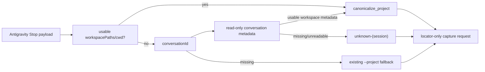

# Antigravity Headless Project Resolution Design

## 문서 상태

- 상태: approved
- 승인 상태: 사용자 승인 완료 (2026-08-30)
- Requirements: `requirements.md`
- Source: [pureliture/dendrite Issue #7](https://github.com/pureliture/dendrite/issues/7)
- Repo: `dendrite`
- 작성일: 2026-08-30

## 설계 방향

Issue #7의 제안에 따라 Antigravity capture의 기존 project resolver에 conversation metadata 역참조를 가장 작은 보강으로 추가한다.

기존 payload workspace resolution, project canonicalization, provider storage path filtering, locator-only request normalization seam을 재사용하고, Antigravity 외 provider의 동작은 변경하지 않는다.

## Agentic implementation amendment

초기 구현은 metadata root의 `conversations/` 하위 `.db`만 탐색했지만, 현재 설치의 `conversation_summaries` store는 metadata root 바로 아래에 있어 headless metadata hit을 만들지 못했다.

가능한 선택지는 기존 탐색 범위 재사용, metadata store 경로 설정 추가, metadata root 전체의 무제한 recursive scan, fallback-only 유지, defer였다.

requirements와 privacy boundary를 유지하면서 현재 observable result에 도달하는 가장 작은 선택으로 metadata root 바로 아래의 `.db`와 `conversations/` 하위 `.db`만 후보로 탐색하도록 확장했다.

canonical owner는 `dendrite`의 Antigravity capture resolver이고, operation responsibility는 local conversation summary store의 read-only/immutable query다.

기존 `conversations/` 전용 후보 집합은 별도 compatibility path가 아니며, root-level 후보를 포함하는 bounded discovery로 대체되었다. provider transcript tree 전체 scan, 새로운 설정 계약, metadata write-back은 이 amendment의 범위가 아니다.

focused tests와 raw value를 출력하지 않는 live metadata smoke에서 metadata hit을 확인한 뒤 이 amendment를 기록했다.

## Resolution flow

## Component responsibilities

### Existing project resolver

`_resolve_project()`는 기존처럼 payload의 usable workspace/cwd를 먼저 검사한다.

Antigravity에서만 payload workspace가 없을 때 `conversationId`를 metadata resolver에 전달한다.

metadata resolver가 돌려준 workspace 값은 기존 `_usable_project_source_path()`와 `canonicalize_project()`를 통해 동일한 label 규칙을 적용한다.

### Conversation metadata resolver

resolver는 provider의 local conversation metadata store에서 `conversation_id`를 parameterized query로 조회하고 `workspace_uris`의 usable entry만 반환한다.

resolver는 raw workspace path, conversation id, SQLite filename, SQL error를 public output에 전달하지 않는다.

store open은 `mode=ro&immutable=1` 또는 동등한 no-write/no-checkpoint 방식으로 제한한다.

metadata store discovery는 현재 Antigravity local metadata layout에 존재하는 conversation summary store만 대상으로 하며, transcript body나 provider storage tree를 검색하지 않는다.

### Session fallback

conversation metadata에 usable workspace가 없으면 `conversationId`에서 raw 값이 아닌 8자리 digest를 만들고 `unknown-<sha8>(session)` 형태의 project label을 반환한다.

conversationId가 없으면 resolver는 기존 `--project` fallback을 유지하여 기존 capture contract의 입력 범위를 넓히지 않는다.

### Request and spool boundary

resolved project label은 기존 `normalize_provider_capture_request()` 결과의 `project`와 `public_summary.project`에만 반영한다.

transcript locator는 기존처럼 private spool-only handle로 유지하며 이번 변경은 locator contract 또는 downstream `POST 18080` 경계를 변경하지 않는다.

## Compatibility rules

- payload workspace가 유효하면 metadata lookup을 수행하지 않는다.
- Antigravity headless payload처럼 `workspacePaths: []`인 경우에만 metadata lookup/fallback을 시도한다.
- `agy-headless-capture`는 launch directory를 payload workspace로 제공하는 기존 경로를 유지한다.
- `codex`, `claude`, `gemini`, `hermes`, `grok`에는 새 metadata lookup을 적용하지 않는다.
- metadata failure는 capture failure가 아니라 project label fallback으로 처리한다.

## Privacy and failure handling

metadata store가 없거나 읽기 실패하면 public error를 만들지 않고 session fallback으로 계속한다.

conversationId가 없어 session fallback을 만들 수 없으면 기존 fallback을 사용한다.

raw metadata 값은 테스트 assertion을 제외한 public output, log, report에 포함하지 않는다.

resolver는 metadata store를 절대 쓰지 않으며 WAL checkpoint나 schema mutation을 호출하지 않는다.

## Verification

최소 검증은 `tests/test_antigravity_capture_payload.py`와 `tests/test_agy_headless_capture.py`에 추가하는 focused tests로 수행한다.

focused tests는 metadata hit, metadata miss, unreadable store, payload precedence, session fallback privacy, TUI compatibility, launch-dir compatibility를 각각 observable result로 검증한다.

그 뒤 저장소의 기존 `uv run pytest -q`를 실행해 non-Antigravity provider와 client boundary regression을 확인한다.

구현은 이 design 문서가 승인된 뒤 전용 worktree에서 `agentic-execution` 계약으로 하나의 observable slice씩 진행한다.

이 design 문서는 2026-08-30 사용자 승인으로 approved 상태이며, 이 문서가 구현 설계의 source of truth다.
