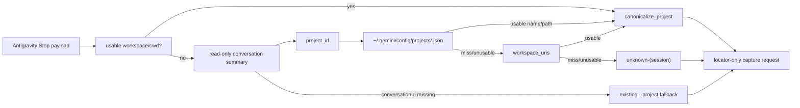

# Antigravity project_id 우선 project resolution Design

## 문서 상태

- 상태: approved
- 승인 상태: 사용자 승인 완료 (2026-08-30)
- Requirements: `requirements.md`
- Source: [pureliture/dendrite Issue #9](https://github.com/pureliture/dendrite/issues/9)
- Related: [PR #8](https://github.com/pureliture/dendrite/pull/8)
- Repo: `dendrite`
- 작성일: 2026-08-30

## 설계 방향

Issue #9의 변경은 기존 Antigravity capture resolver에 `project_id` metadata source를 추가하는 bounded 보강으로 구현한다.

직접 payload workspace resolution, `canonicalize_project()`, provider storage path filtering, locator-only request normalization과 PR #8의 `workspace_uris` resolver를 재사용한다.

기존 payload workspace는 metadata보다 먼저 유지하고, metadata가 필요한 headless 경로에서만 `project_id`를 `workspace_uris`보다 먼저 조회한다.

Antigravity 외 provider의 resolution behavior와 `POST 18080` client boundary는 변경하지 않는다.

## Agentic implementation amendment

승인된 후보 집합만 사용하면 `projectResources.resources[0]`가 비어 있는 headless/default project에서 이름을 복원할 수 없다는 blocker가 실제 설치 구조 확인에서 관찰됐다.

구조 확인은 raw project id와 path를 출력하지 않고 project definition의 top-level `name`, `projectResources.resources` 배열, `gitFolder.folderUri` key만 확인했다.

requirements와 privacy boundary를 유지하면서 Issue #9의 named project observable result에 도달하는 가장 작은 선택으로 resource 후보 뒤에 project definition의 top-level `name`을 마지막 후보로 추가했다.

중첩 resource만 사용하는 선택은 빈 resources 사례를 놓치고, top-level name만 우선하는 선택은 usable folder path의 정확도를 낮춘다. projects directory recursive scan, 새로운 provider config, metadata write-back은 현재 slice에 필요한 범위를 넘거나 privacy/ownership boundary를 넓히므로 선택하지 않았다.

구현 evidence는 `uv run pytest -q tests/test_antigravity_capture_payload.py`의 `32 passed`이며, project definition 후보 우선순위와 빈 resources의 top-level name fallback을 포함한다.

canonical owner는 `dendrite`의 Antigravity capture resolver이고, operation responsibility는 summary store와 project definition의 bounded read-only query다.

## Resolution flow

## Component responsibilities

### Existing project resolver

`src/dendrite/transcript_capture.py`의 `_resolve_project()`는 payload의 usable workspace/cwd를 먼저 검사한다.

payload workspace가 없고 `provider=antigravity`이면 conversation metadata resolver에 `conversationId`를 전달한다.

metadata resolver가 반환한 name/path/URI는 기존 `_usable_project_source_path()`와 `canonicalize_project()`를 통과시켜 동일한 project label 규칙을 적용한다.

### Conversation summary resolver

resolver는 local `conversation_summaries` store에서 `conversation_id`를 parameterized query로 조회하고 `project_id`와 `workspace_uris`를 사용한다.

`project_id`가 있으면 exact project definition file을 조회하고, usable name/path를 찾지 못했을 때만 기존 `workspace_uris` resolver로 진행한다.

summary store는 read-only/immutable 방식으로 열고, project definition JSON은 read-only로 읽는다. 어떤 store path, raw id, SQL/JSON error도 public output에 전달하지 않는다.

### Project definition resolver

resolver는 `projects/<project_id>.json` 하나를 bounded candidate로 사용하며 projects directory 전체의 recursive scan은 수행하지 않는다.

`projectResources.resources[0]`의 `gitFolder.folderUri`, `folderUri`, `name` 후보를 순서대로 검사한 뒤 project definition의 top-level `name`을 검사한다.

`file://` URI는 PR #8의 workspace URI decoding 규칙을 재사용하고, symlink 또는 provider storage path는 기존 source path guard로 제외한다.

project definition이 없는 `project_id`는 capture error가 아니라 `workspace_uris` metadata miss로 처리한다.

### Fallback and request boundary

`project_id`와 `workspace_uris`에 usable source가 없고 `conversationId`가 있으면 기존 `_antigravity_session_project_fallback()`의 opaque digest label을 사용한다.

`conversationId`가 없으면 기존 `--project` fallback을 유지한다.

최종 label은 기존 `normalize_provider_capture_request()` 결과의 `project` 및 `public_summary.project`에만 반영한다.

transcript locator는 private spool-only handle로 유지하며 provider hook, spool/outbox, thin shipper 및 `POST 18080` 계약은 변경하지 않는다.

## Compatibility and failure handling

- usable payload workspace가 있으면 metadata lookup을 수행하지 않는다.
- Antigravity headless처럼 payload workspace가 없는 경우에만 `project_id`와 `workspace_uris` metadata lookup을 시도한다.
- `agy-headless-capture`는 launch directory를 workspace source로 제공하는 기존 경로를 유지한다.
- `codex`, `claude`, `gemini`, `hermes`, `grok`에는 새 metadata lookup을 적용하지 않는다.
- metadata file/store miss, malformed data, permission error는 label fallback으로 처리하고 capture failure나 public error로 만들지 않는다.

## Verification design

focused tests는 project_id hit, project definition field precedence, 빈 resources의 top-level name, project_id miss + workspace_uris hit, 양쪽 metadata miss의 session fallback, payload workspace precedence, TUI compatibility, launch-dir compatibility, read-only safety와 privacy를 각각 observable result로 검증한다.

그 뒤 `uv run pytest -q`로 non-Antigravity provider, locator-only boundary 및 기존 client regression을 확인한다.

실제 `agy` 호출 convention 표준화와 global Stop hook 설치/활성화는 이 design의 구현 대상이 아니다.

이 design 문서는 2026-08-30 사용자 승인으로 approved 상태이며, 이 문서가 구현 설계의 source of truth다.
