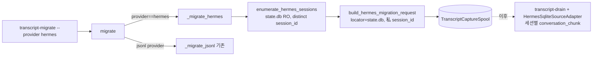

# Hermes Bulk Migration Design Spec

## Overview

기존 `transcript-migrate`에 Hermes 분기를 추가해, 과거 Hermes 세션(단일 SQLite store의
행)을 세션 단위로 열거하고 세션별 locator-only capture request를 spool한다. 실제 ship은
기존 `transcript-drain` + `HermesSqliteSourceAdapter`(세션별 conversation_chunk)를 그대로
재사용한다. 새 ship 경로는 만들지 않는다.

## Requirements Reference

- Phase 1 source: `requirements.md`
- 핵심: SQLite-aware enumerator(read-only/immutable) → 세션별 locator-only spool →
  기존 drain으로 ship. `--dry-run`/`--limit`, 멱등, 기존 jsonl migration 무회귀, 카운트만 보고.

## Approach Proposal

### 선택안 A (채택): migration 루프에 store-kind 분기

기존 file-glob migration 로직을 `_migrate_jsonl`로 추출(동작 보존)하고, `_migrate_hermes`를
추가한다. Hermes store는 dir이 아니라 file이며, 세션 열거는 SQLite `messages`의 distinct
`session_id`로 한다.

- 장점: 기존 코드 최소 변경, jsonl 경로 보존, SQLite 지식은 `transcript_source`에 모임.
- 단점: migrate 루프에 분기 1개.

### 선택안 B (기각): 별도 `hermes-migrate` 명령

별도 명령은 CLI/문서 표면을 늘리고 `transcript-migrate`와 중복된다. 단일 명령 + provider
분기가 사용자 멘탈모델(`--provider`)과 일치.

**결정: A.**

## Architecture



### Module Boundaries

| 모듈 | 변경 | 책임 |
| --- | --- | --- |
| `transcript_source.py` | `enumerate_hermes_sessions(db_path)` 추가(RO/immutable, distinct session_id, 내용 미열람) | SQLite 지식 일원화 |
| `transcript_migrate.py` | `MIGRATION_PROVIDERS += hermes`; `default_source_roots`에 hermes(state.db file); 루프를 `_migrate_jsonl`/`_migrate_hermes`로 분기; `build_hermes_migration_request` | bulk 열거→spool |
| `cli.py` | 변경 없음(choices=list(MIGRATION_PROVIDERS) 자동 반영) | CLI 노출 |
| `transcript_drain.py`/adapter | 변경 없음(ship 재사용) | thin shipper |

## Data Flow

```mermaid
sequenceDiagram
  participant Op as Operator
  participant M as _migrate_hermes
  participant E as enumerate_hermes_sessions
  participant S as TranscriptCaptureSpool
  Op->>M: --provider hermes [--dry-run|--limit N]
  M->>E: state.db(RO/immutable) distinct session_id
  E-->>M: [sid...] (내용 미열람)
  loop 세션마다 (limit 적용)
    M->>M: build_hermes_migration_request(db, sid, project) (locator-only)
    alt dry-run
      M->>M: count++ (spool 안 함)
    else
      M->>S: enqueue(request) (멱등: request_id)
    end
  end
  M-->>Op: report(카운트만; 원경로/세션id/내용 없음)
```

## Component Details

### `enumerate_hermes_sessions(db_path) -> list[str]` (transcript_source.py)
- `db_path`를 is_file + non-symlink 검증. `sqlite3.connect("file:<path>?mode=ro&immutable=1")`.
- `PRAGMA table_info(messages)`로 컬럼 탐지. `session_id` 컬럼 있으면
  `SELECT DISTINCT session_id FROM messages WHERE session_id IS NOT NULL ORDER BY session_id`
  → 세션 id 리스트(메시지 보유 세션만). 컬럼 없으면 `[""]`(단일 세션 store). 읽기 불가/스키마
  불일치 → `[]`. write/checkpoint 없음, 내용 미열람. `finally`에서 close.

### `default_source_roots()` hermes 항목 (transcript_migrate.py)
- `HERMES_HOME` 있으면 `$HERMES_HOME/state.db`, 없으면 `~/.hermes/state.db`(=`home/.hermes/state.db`).
  이는 dir이 아니라 **file** 경로.

### `_migrate_hermes(provider, root, spool, project, limit, dry_run) -> dict`
- root(state.db file) is_file 아니면 `{status: root_unavailable, found:0, spooled:0, errors:0}`.
- `sessions = enumerate_hermes_sessions(root)`; `limit` 있으면 `sessions[:max(limit,0)]`.
- 세션마다 `build_hermes_migration_request` → dry_run 아니면 `spool.enqueue`. per-session
  fail-soft(errors 카운트, error_classes 집계).
- 반환 `{status: ok, found: len(sessions), spooled, errors}`. **원경로/세션id 미포함**(root는
  비경로 라벨 또는 생략).

### `build_hermes_migration_request(db_path, session_id, project) -> dict`
- payload `{"transcript_path": str(db_path), "session_id": session_id}` →
  `normalize_provider_capture_request("hermes", payload, project=project)`. 결과는 단건 capture와
  동일 locator-only request(locator=state.db, 私 session_id, content_policy=locator_only).

### `_migrate_jsonl(...)` (기존 로직 추출)
- 현재 file-glob 로직(enumerate_sessions + build_migration_request)을 그대로 함수로 분리.
  동작 보존(특성화: 기존 `test_transcript_migrate.py` green 유지).

### `parse_source_root_overrides`
- `MIGRATION_PROVIDERS`에 hermes 포함되므로 `hermes=/path/to/state.db` override 허용
  (`expanduser`). 변경 최소.

## Error Handling

| 시나리오 | 처리 |
| --- | --- |
| state.db 없음/비file | `_migrate_hermes` root_unavailable(카운트 0). |
| 비-SQLite/스키마 불일치 | `enumerate_hermes_sessions` → `[]` → found 0. |
| 특정 세션 request 빌드 실패 | per-session fail-soft, errors++ + error_classes 집계. |
| SQLite 잠금/WAL | RO/immutable로 회피(write/checkpoint 없음). |
| 기존 jsonl provider | `_migrate_jsonl` 그대로(무회귀). |

## Testing Strategy

- `uv run pytest -q`. 신규 케이스를 `tests/test_transcript_migrate.py`(또는 hermes 전용 파일)에 추가.
- 케이스:
  1. enumerate: 합성 multi-session DB → distinct session_id(정렬), 메시지 보유 세션만. no-session_id
     컬럼 → `[""]`. 비-sqlite/없음 → `[]`. read-only(mtime/size 불변).
  2. dry-run: 3세션 DB → found=3, spooled=0, spool 미생성.
  3. spool: 3세션 → spooled=3, pending 3건, 각 request locator=db + 私 session_id 설정,
     public_summary에 원경로/세션id 미포함.
  4. limit: limit=1 → found/spooled=1.
  5. 멱등: 2회 실행 후 pending 여전히 3건(중복 파일 없음).
  6. report: 카운트만(원경로/세션id/내용 미포함).
  7. jsonl regression: 기존 migrate 테스트 green.
  8. boundary: `test_client_boundary`/`test_repo_instructions` green.
- evidence: 위 green + 맥미니 실 `state.db`로 `--dry-run` 18세션 카운트(read-only, 미출력) +
  `--limit 1` spool→drain conversation_chunk 1건(가짜 ingress).

## TDD Strategy

red -> green -> refactor. enumerate/_migrate_hermes는 합성 SQLite 픽스처로 red→green.
jsonl 로직 추출은 특성화 테스트(기존 migrate 테스트)로 동작 보존. 문서 갱신은 no-test-seam 예외.

## Milestones

- M1: `enumerate_hermes_sessions`(transcript_source) + 단위 테스트(distinct/정렬/단일/빈/RO). done: green.
- M2: migrate hermes 분기 — `MIGRATION_PROVIDERS`/`default_source_roots`/`_migrate_jsonl` 추출/
  `_migrate_hermes`/`build_hermes_migration_request`. done: dry-run/spool/limit/멱등 테스트 green +
  jsonl regression green.
- M3: 맥미니 실 DB `--dry-run` 18세션 스모크(read-only) + `--limit 1` spool→drain 단건 +
  docs(HERMES_PROVIDER에 migration 절). done: 스모크 evidence + 문서.
- M4: Full verify — `uv run pytest -q` 전체 green.

## Open Questions

- 세션 정렬 기준: 현재 session_id 정렬(결정적). 필요 시 started_at 순으로 변경 가능(YAGNI).
- live ship endpoint 검증은 이번 scope 밖(별도).

## Review Feedback Log

- (초안) 자문자답 + 코드(`transcript_migrate.py`/adapter) + 맥미니 실측 스키마 기반. 사용자 사전
  승인에 따라 design 완성 즉시 agentic-execution 핸드오프.
