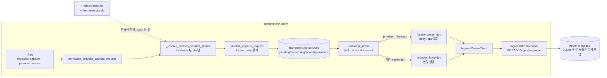
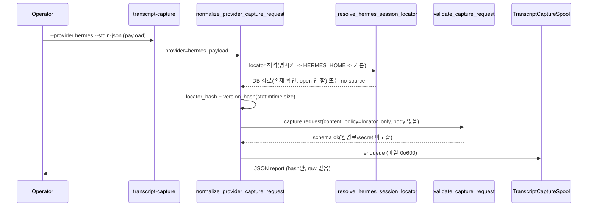
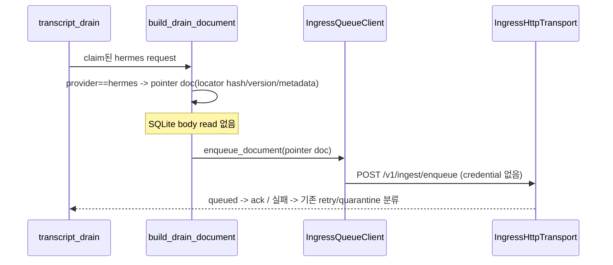

# Hermes Provider Capture Design Spec

## Overview

`dendrite`(Mac thin-client)에 Hermes agent를 capture 대상 provider로 추가한다.
Hermes 세션은 단일 SQLite store(`~/.hermes/state.db`)에 저장되므로, 기존 jsonl
provider와 달리 **locator-only pointer provider**로 통합한다. dendrite는 store의
locator(경로 handle)와 안전 metadata만 다루고 SQLite body는 절대 열거나 파싱하지
않는다. 실제 세션 본문 추출은 neurons(server/brain)의 책임이다.

## Requirements Reference

- Phase 1 source: `requirements.md`
- 핵심 요구:
  - Hermes를 canonical `hermes`로 식별 site 전 구간에 일관 등록.
  - locator resolver(명시 config -> `HERMES_HOME` -> 기본 `~/.hermes/state.db`) +
    존재 기반 detector(SQLite open/query 금지).
  - 기존 `locator_only` capture request schema 호환 envelope 생성.
  - approved ingress(`POST /v1/ingest/enqueue`)만 사용하는 pointer-only drain ship.
  - 기존 codex/claude/gemini/antigravity regression 금지.
  - server brain/session-memory build/GC/RAGFlow write 책임 미추가.

## Approach Proposal

### 선택안 A (추천): Locator-only pointer provider + 좁은 hermes 분기

Hermes를 다른 provider와 동일한 식별 체계로 등록하되, drain에서 SQLite body를 읽지
않고 locator pointer 문서만 ship하는 좁은 `provider == 'hermes'` 분기를 둔다.

- 장점: thin-client 경계 준수(파싱 위임), full path(identity->locator->spool->ship)
  실제 동작, 기존 4개 provider 경로 무변경 -> regression risk 최소.
- 단점: drain에 provider 분기 1개 추가. dendrite는 Hermes 본문을 ship하지 않음
  (의도된 제한; 본문 추출은 neurons).

### 선택안 B: `SOURCE_UNPROVEN_PROVIDERS`로만 staging

Hermes를 `SOURCE_UNPROVEN_PROVIDERS`에 넣어 locator 추출을 bypass(빈 locator)하고
source_status=`source_unproven`으로 둔다.

- 장점: 코드 변경 최소, 가장 보수적.
- 단점: 빈 locator라 envelope에 실제 session locator가 없고, drain이 unproven을
  permanent quarantine 처리하여 neurons로 **실제 ship되지 않음** -> 완료 기준
  "neurons로 보낼 수 있는 redacted envelope 생성"을 약하게만 만족. 채택 안 함.

### 선택안 C: dendrite에 SQLite transcript extractor 구현

dendrite가 `state.db`를 read-only로 열어 세션을 추출/redact해 body를 ship.

- 장점: 다른 provider와 ship 형태가 동일.
- 단점: SQLite open/query는 detector 금지 사항이고, transcript build는 neurons
  책임(thin-client 경계 위반). WAL checkpoint/락 리스크. 채택 안 함.

**결정: 선택안 A.** 경계 준수와 end-to-end 동작을 동시에 만족하고 regression risk가
가장 낮다. (general한 "parser-unverified면 pointer ship" 규칙은 YAGNI로 미루고, 이번엔
명시적 hermes 분기로 한정한다.)

## Architecture

### Module Boundaries

| 모듈 | Hermes 변경 | 책임 |
| --- | --- | --- |
| `provider_contracts.py` | `SUPPORTED_PROVIDERS += 'hermes'`; `build_default_provider_source_contracts()`에 hermes 계약 1건 추가; `_provider_config_plan` hermes 분기(설정 없음 -> `{}`, deferred) | provider 식별/계약/hook-plan |
| `providers/contracts.py` | `no_op_hook_response`/`normalize_provider_event` 허용집합에 `hermes` 추가; `_normalize_hermes_hook_event` 추가 + dispatch | hook payload 정규화 |
| `providers/__init__.py` + `providers/hermes.py` | `__all__ += 'hermes'`; `PROVIDER = 'hermes'` stub | provider 모듈 등록 |
| `transcript_capture.py` | `SUPPORTED_TRANSCRIPT_PROVIDERS += 'hermes'`; `_resolve_hermes_session_locator` 추가; `_extract_source_locator`/`_capture_event_type` hermes 분기; `_looks_like_provider_storage_path`에 `.hermes` 인지 추가 | locator-only capture 생성 |
| `transcript_drain.py` | `build_drain_document`에 `provider=='hermes'` pointer-only 분기(body read 없음) | thin shipper |
| `cli.py` | `hook-plan`/`transcript-capture` `--provider` choices에 `hermes` 추가 | CLI 노출 |
| `transcript_migrate.py` | **변경 없음**(jsonl glob 부적합) | 단일 SQLite store라 backfill 제외 |
| `ingress_transport.py` / `transcript_ingest.py` / `spool.py` | **변경 없음** | provider-agnostic 전송/영속 |

## Data Flow

### Hermes capture (locator-only)

### Hermes drain (pointer ship)

## Component Details

### `_resolve_hermes_session_locator(payload) -> str | ""`
- 입력: hook/CLI payload dict.
- 우선순위: payload의 명시 locator 키(`source_locator`/`transcript_path`/
  `transcriptPath`/`hermes_db_path` 등 기존 키 + hermes 전용 키) -> `HERMES_HOME`
  env -> 기본 `~/.hermes/state.db`.
- 동작: 경로 문자열 해석 + 파일 **존재 확인만**. SQLite open/connect/query 금지.
  존재하지 않으면 `""` 반환(상위에서 no-source/skip 처리, 날조 금지).
- 출력: 단일 경로 문자열. 기존 `_validate_locator_value`(단일 라인, 공백 토큰 금지,
  secret-shape 금지, <=4096) 통과 대상.
- version hash: 기존 `_source_locator_version_hash`(stat의 `mtime_ns:size` sha256)
  재사용 — body 미열람.

### Hermes `ProviderSourceContract`
- `provider='hermes'`, `hook_event`=Hermes session-end 의미의 명시 문자열.
- `source_locator_field`=resolver가 채우는 locator 필드명.
- `native_parser_status`/`verification_status`: **unverified**로 정직하게 표기
  (live smoke 미수행). antigravity 계약을 템플릿으로 하되 live-smoke 주장 금지.
- `source_status`: 실제 존재 확인된 locator 기준 ship-eligible 값(빈 locator인
  `source_unproven` 사용 안 함). 본문 미파싱은 `native_parser_status`와 drain pointer
  분기로 표현.
- `hook_install_status='deferred_not_installed'`, `evidence_hash='pending_probe'`
  (antigravity와 동일 sentinel), `unsupported_reason`에 "Hermes hook API 미확정 +
  SQLite store 본문 추출은 neurons 위임" 명시.
- `_provider_config_plan(hermes)`는 `{}` 반환(설치 config 없음, deferred).
- doctor/hook-plan 불변식 유지: network_used/mutation flag 모두 False, plan_only.

### `build_drain_document` hermes pointer 분기
- `provider == 'hermes'`이면 `source_locator.runtime_handle`을 **읽지 않고**,
  locator pointer 문서를 구성: provider, locator_hash, locator_version_hash,
  observed_at, redacted workspace metadata, `content_kind='locator_pointer'`.
- contentHash는 pointer 문서 metadata 기준으로 계산. 기존 `IngressQueueClient.
  enqueue_document` -> `IngressHttpTransport`(approved path)로 그대로 전달.
- 문서 schema가 본문 필수면, pointer 본문은 transcript가 아닌 안전 metadata JSON
  문자열로 채우고 raw 필드 금지를 유지(구현 시 schema 수용 확인).

### `_normalize_hermes_hook_event` + `_capture_event_type` hermes 분기
- payload의 Hermes hook event 이름을 canonical event(`session_end` 등)로 매핑.
- 불명 시 기존 fallback(`payload.get('event_type','session_end')`) 활용.
- `SAFE_PAYLOAD_FIELDS` allowlist 준수, `RAW_TRANSCRIPT_FIELDS` 포함 시 기존대로 거부.

### `_looks_like_provider_storage_path` `.hermes` 인지
- `('.hermes',)` 또는 `('.hermes','state.db')` 패턴을 provider storage로 인지해
  workspace/project 추론에서 제외(다른 provider storage 패턴과 동일 취급).

## Error Handling

| 시나리오 | 처리 |
| --- | --- |
| `state.db` 없음 | resolver `""` 반환 -> capture skip/no-source. 날조 금지, 비정상 종료 아님. |
| locator에 공백/secret-shape | 기존 `_validate_locator_value`가 거부(기본 경로엔 공백 없음). |
| payload에 raw transcript 필드 | 기존 `RAW_TRANSCRIPT_FIELDS` 검사로 `ValueError` (hermes 우회 금지). |
| SQLite 잠금/WAL | 파일을 열지 않으므로 해당 없음(설계상 회피). |
| drain 네트워크 실패 | 기존 `RECOVERABLE_ERROR_CLASSES` retry/quarantine 분류 그대로. |
| 미지원 provider 문자열 | 기존 fail-closed `ValueError` 유지. |
| 알 수 없는 hermes hook event | `_capture_event_type` fallback으로 안전 기본 event. |

## Testing Strategy

- 프레임워크: `uv run pytest -q` (worktree 루트). 신규 `tests/test_hermes_capture_payload.py`는
  `tests/test_antigravity_capture_payload.py`를 템플릿으로 한다.
- 필수 케이스:
  1. 식별: hermes가 `SUPPORTED_PROVIDERS`/`SUPPORTED_TRANSCRIPT_PROVIDERS`/
     `no_op_hook_response`/`normalize_provider_event`/contract 목록/CLI choices에
     모두 등록. `test_provider_contracts.py`의 set-equality 단언을 hermes 포함으로 갱신.
  2. locator-only capture: hermes payload -> capture request가 `content_policy==
     'locator_only'`, body 없음, `public_summary`/직렬화에 원 DB 경로 미포함, spool
     파일 0o600.
  3. detector 안전성: resolver/detector가 SQLite를 open/connect하지 않음(파일 미열람
     검증 — 예: read 호출/connect monkeypatch가 호출되지 않음).
  4. raw 거부: `RAW_TRANSCRIPT_FIELDS` 포함 payload는 `ValueError`.
  5. drain pointer ship: hermes request가 body read 없이 pointer 문서로 approved
     endpoint(`/v1/ingest/enqueue`)에 enqueue됨. 본문/원경로/credential 미출력.
  6. regression: codex/claude/gemini/antigravity가 그대로 식별되고 drain에서 body를
     redact해 ship(기존 동작 불변).
  7. client boundary: 신규 파일이 `FORBIDDEN_IMPORT_ROOTS`/`FORBIDDEN_SOURCE_FRAGMENTS`
     (docker, RAGFLOW_API_KEY, brain_query, Ledger 등) 미위반.
  8. approved endpoint: shipper가 고정 path만 사용, URL credential 거부 동작 유지.
- evidence: 위 test green + L2 로컬 smoke(`transcript-capture --provider hermes`가
  hash만 담은 JSON report 생성, 원경로/raw 미출력).

## TDD Strategy

code-changing work이므로 red -> green -> refactor를 기본으로 한다.

- 각 milestone은 동작 test를 먼저 추가하고 fail(red)을 확인한 뒤 production code로
  green을 만든다. 식별/capture/drain/regression 순으로 red 테스트를 선행한다.
- docs/sample-config milestone(M4의 문서 부분)은 no-test-seam 예외로, 대체 evidence는
  렌더된 문서 내용과 boundary test 통과로 갈음한다.

## Milestones

agentic-execution이 act->observe->adjust로 소비할 evidence 단위. 순서는 권장이며 각
단위는 done 정의와 기대 evidence를 가진다.

- M0: Red 테스트 선작성 — 식별/locator-only capture/detector 안전/drain pointer/
  regression에 대한 실패 테스트 작성. done: 새 테스트가 의도대로 red.
- M1: Provider identity green — 6개 식별 site + `providers/hermes.py` stub + contract
  추가. done: 식별 테스트 green, `test_provider_contracts` set-equality 갱신 반영.
- M2: Locator + detector + capture green — `_resolve_hermes_session_locator`,
  capture 분기, `.hermes` storage 인지. done: locator-only capture/detector 안전/raw
  거부 테스트 green, SQLite 미열람 증명.
- M3: Drain pointer ship + regression green — `build_drain_document` hermes pointer
  분기. done: hermes pointer ship 테스트 green + 4개 provider regression green.
- M4: CLI + hook-plan deferred + docs/sample — CLI choices, deferred hook-plan,
  enable 방법/안전 경계/샘플 설정 문서화. done: CLI로 hermes 도달 가능, hook-plan이
  non-mutating deferred plan 출력, 문서/샘플 존재 + boundary test 통과.
- M5: Full local verification — `uv run pytest -q` 전체 green + L2 로컬 smoke evidence
  (raw/원경로/credential 미출력 확인). done: 전체 통과 + smoke JSON report 증거.

## Open Questions

- Hermes hook/extension API 1차 자료(없으면 hook install deferred 유지, capture는
  explicit invocation으로 동작).
- pointer 문서의 ingress schema 정확 수용 형태(M3 구현 시 `PackedTranscriptDocument`/
  `rag_ingress_enqueue.v1` 수용 확인. 본문 필수면 안전 metadata JSON으로 충족).
- 세션 단위 granularity(현재 DB-file pointer; per-session 추출은 neurons 위임).

## Review Feedback Log

- (초안) grill-to-spec 자문자답 + 7개 sonnet 리서치 + Hermes 공식 문서 기반 작성.
  사용자 사전 승인에 따라 design 완성 즉시 agentic-execution으로 핸드오프.
