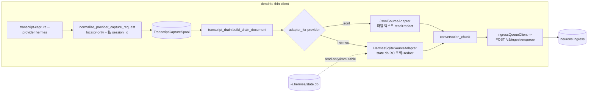
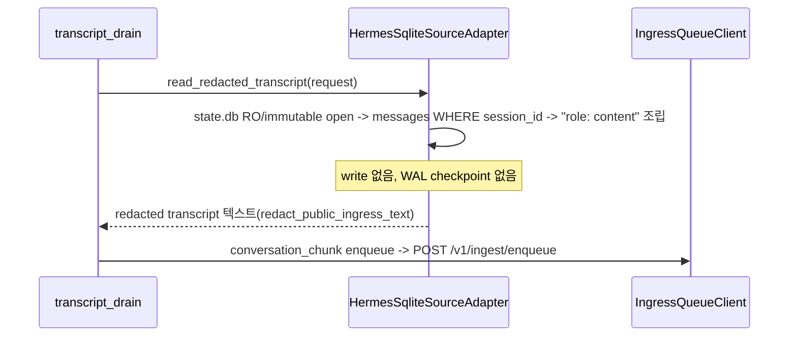

# Hermes Provider Capture Design Spec

## Overview

`dendrite`(Mac thin-client)에 Hermes agent를 capture 대상 provider로 추가한다.
Hermes 세션은 단일 SQLite store(`~/.hermes/state.db`)에 저장된다. dendrite는 기존
provider처럼 **capture는 locator-only**(store 경로만 기록)로 두고, **drain(thin shipper)**
시점에 **하나의 source adapter 인터페이스**로 소스를 읽어 다른 provider와 **동일한
`conversation_chunk`** 문서로 ship한다. Hermes는 SQLite를 read-only로 읽는 adapter를
쓰고, codex/claude/gemini/antigravity는 기존 jsonl 텍스트 adapter를 쓴다.

이 설계는 dendrite가 *이미* 하던 일("provider 로컬 소스를 읽어 redacted 대화 문서로
전달")을 adapter로 일반화한 것이다. session-memory build/promote, GC, RAGFlow write 등
server/brain 책임은 여전히 neurons 소유이며 dendrite는 추가하지 않는다.

## Requirements Reference

- Phase 1 source: `requirements.md`
- 핵심 요구:
  - Hermes를 canonical `hermes`로 식별 site 전 구간에 일관 등록.
  - capture는 locator-only(store 경로 + 안전 metadata). 본문 미열람.
  - drain은 source adapter로 소스를 읽어 redacted `conversation_chunk` ship → neurons가
    이미 수용(neurons 수정 불필요).
  - Hermes adapter는 SQLite를 read-only/immutable로 열고(write/checkpoint 금지) 해당
    세션만 추출, redact 후 ship.
  - approved ingress(`POST /v1/ingest/enqueue`)만 사용. 기존 4개 provider 무회귀.
  - server brain/session-memory build/GC/RAGFlow write 책임 미추가.

## Approach Proposal

### 선택안 A: pointer + neurons 계약 (기각)

Hermes를 locator pointer로 ship하고 neurons에 pointer kind/소비자를 추가. cross-repo
작업이 선행돼야 하고, neurons를 고치기 전엔 end-to-end가 동작하지 않음.

### 선택안 B (채택): source adapter 인터페이스 1개 + provider별 adapter

`build_drain_document`가 provider별 `TranscriptSourceAdapter`로 소스를 읽어 redacted
transcript 텍스트를 얻고, 모두 동일한 `conversation_chunk`로 pack/ship.

- 장점: Hermes가 다른 provider와 **동일한 ship 형태(conversation_chunk)** → neurons가
  이미 수용 → **neurons 수정 0, 즉시 end-to-end**. drain/spool/shipper는 provider-agnostic
  유지. jsonl 경로는 adapter로 추출만 하면 동작 보존.
- 단점: dendrite가 Hermes SQLite를 read-only로 열고 그 스키마를 안다(약간 두꺼워짐).
  잠금/WAL은 read-only/immutable open으로 회피.

**결정: 선택안 B.** "DB가 Mac 로컬이라 server(neurons)가 직접 못 읽음 → Mac 쪽 추출이
어차피 필요"라는 구조적 이유 + 단일 인터페이스로 깔끔히 떨어짐. dendrite의 thin 경계는
"transcript 문서 생산"까지로 유지되고(이미 jsonl로 하던 일), session-memory build는 계속
neurons 몫이다.

(이력: 초기엔 pointer+defer 설계였으나, system-architecture 리뷰가 neurons allowlist의
pointer 미수용을 발견 → 사용자와 재논의 → B로 전환. Review Feedback Log 참조.)

## Architecture



### Module Boundaries

| 모듈 | Hermes 변경 | 책임 |
| --- | --- | --- |
| `transcript_source.py` (신규) | `TranscriptSourceAdapter` 인터페이스 + `JsonlSourceAdapter`/`HermesSqliteSourceAdapter` + `adapter_for()` | provider 소스 → redacted transcript 텍스트 |
| `transcript_drain.py` | `build_drain_document`가 `adapter_for(provider)`로 소스 읽기(provider-agnostic). jsonl read 헬퍼는 adapter로 이동 | thin shipper |
| `transcript_capture.py` | hermes locator resolver(state.db, 존재/심볼릭링크 검증, 미열람) + 私 raw `session_id`를 spool request에 보관 | locator-only capture |
| `provider_contracts.py` | hermes `ProviderSourceContract`(unverified, hook deferred) | 식별/계약/hook-plan |
| `providers/contracts.py` + `providers/__init__.py` + `providers/hermes.py` | hermes 정규화/allowlist/stub | hook payload 정규화 |
| `cli.py` | hook-plan/transcript-capture `--provider`에 hermes | CLI 노출 |
| `transcript_ingest.py`/`ingress_transport.py`/`spool.py` | 변경 없음 | provider-agnostic 전송/영속 |
| `transcript_migrate.py` | 변경 없음(jsonl glob 부적합, hermes 제외) | backfill |

## Data Flow

### Hermes capture (locator-only)

```mermaid
sequenceDiagram
  participant CLI as transcript-capture
  participant N as normalize_provider_capture_request
  participant R as _resolve_hermes_session_locator
  participant S as TranscriptCaptureSpool
  CLI->>N: provider=hermes, payload(session_id, transcript_path?)
  N->>R: locator 해석(명시키 -> HERMES_HOME -> 기본), 존재/심볼릭링크 검증, 미열람
  R-->>N: state.db 경로(or no-source)
  N->>S: spool request(content_policy=locator_only, runtime_handle=state.db, 私 session_id, 해시들)
  S-->>CLI: JSON report(hash만; 원경로/세션id 미출력)
```

### Hermes drain (SQLite adapter → conversation_chunk)



## Component Details

### `TranscriptSourceAdapter` (인터페이스 1개)
- `read_redacted_transcript(request) -> str`: request의 로컬 소스를 읽어 **redacted
  transcript 텍스트** 반환. 실패 시 `ValueError('source_unproven'|'source_policy_blocked'
  |'source_unreadable')`로 drain이 분류/quarantine.
- `adapter_for(provider)`: hermes→`HermesSqliteSourceAdapter`, 그 외→`JsonlSourceAdapter`.

### `JsonlSourceAdapter` (codex/claude/gemini/antigravity)
- `runtime_handle`(.jsonl) 경로를 `_source_path`로 검증 후 텍스트로 read → redact+truncate.
  기존 `build_drain_document` 동작을 그대로 옮긴 것(무회귀).

### `HermesSqliteSourceAdapter` (hermes)
- `runtime_handle`(state.db)를 `_source_path`로 검증.
- `sqlite3.connect("file:<path>?mode=ro&immutable=1", uri=True)`로 **read-only/immutable**
  open: 잠금 없음, WAL checkpoint 없음, write 없음.
- `PRAGMA table_info(messages)`로 컬럼 탐지(스키마 tolerant). `content` 필수.
  `session_id` 컬럼 + request의 私 `session_id`가 있으면 그 세션만 `WHERE session_id=?`로
  조회, `timestamp`(없으면 rowid) 순. `role: content` 라인으로 조립 → redact+truncate.
- 스키마는 Hermes session-storage 문서 기준 가정. live Hermes 설치 대상 검증은 미수행
  (contract `native_parser_status=native_parser_unverified_hermes_sqlite`).

### Capture: 私 raw session_id
- `normalize_provider_capture_request`가 spool request에 `session_id`(raw) 보관. spool은
  0o600 private이며 public_summary/CLI 출력/shipped 문서에는 미포함(거긴 session_id_hash만).
  SQLite adapter가 세션 선택에 사용.

### `_resolve_hermes_session_locator`
- payload 명시 키(`hermes_db_path`/`state_db_path`/`session_db_path`/`transcript_path`/
  `source_locator`/`transcriptPath`/`runtime_handle`) → `HERMES_HOME` → 기본
  `~/.hermes/state.db` 순. **존재 + non-symlink 검증만**, SQLite open 안 함. 없으면 빈 locator.

### Hermes contract / hook
- hook이 존재함이 확인됨(Hermes shell hook: `~/.hermes/config.yaml`, session-end 이벤트,
  stdin JSON에 `session_id`/`cwd`; 단 transcript/DB 경로는 미제공 → dendrite가 store 해석).
- contract: `hook_install_status=deferred_not_installed`(dendrite 자동설치 안 함),
  `source_status=source_locator_unverified`(live-smoke 미수행) → hook-plan은 non-mutating
  `blocked_source_unproven`. evidence_hash=`pending_probe`.

## Error Handling

| 시나리오 | 처리 |
| --- | --- |
| `state.db` 없음(capture) | locator "" → no-source. 날조 금지. |
| 심볼릭링크 store | `_source_path` `source_policy_blocked` → quarantine. |
| 유효하지 않은 SQLite/스키마 불일치 | adapter `source_unreadable` → quarantine(크래시 아님). |
| payload raw transcript 필드 | 기존 `RAW_TRANSCRIPT_FIELDS` 검사로 `ValueError`. |
| SQLite 잠금/WAL | RO/immutable open으로 회피(write/checkpoint 없음). |
| drain 네트워크 실패 | 기존 `RECOVERABLE_ERROR_CLASSES` retry/quarantine. |
| 미지원 provider | 기존 fail-closed `ValueError`. |

## Testing Strategy

- `uv run pytest -q`. 신규/갱신 `tests/test_hermes_capture_payload.py`.
- 케이스:
  1. 식별: hermes가 모든 allowlist/contract/CLI choices에 등록. `test_provider_contracts`
     set-equality에 hermes 포함, hermes는 unverified.
  2. capture locator-only: store 경로 기록, 본문 미열람, public_summary에 원경로/세션id 미포함.
     私 raw session_id 보관 + public 미노출.
  3. locator resolve: 명시 경로/HERMES_HOME/기본, 부재·심볼릭링크 시 빈 locator.
  4. raw 거부: `RAW_TRANSCRIPT_FIELDS` 포함 시 `ValueError`.
  5. drain adapter ship: 합성 SQLite store에서 해당 세션만 conversation_chunk로 ship,
     다른 세션 content 미포함, 본문/메타/source에 원경로·세션id 미포함.
  6. redaction: message content의 비밀(예: /Users 경로)이 shipped body에서 redact.
  7. read-only: drain 후 store mtime/size 불변, WAL/journal sidecar 미생성.
  8. unreadable store → quarantine(크래시 아님).
  9. regression: codex 등 jsonl이 그대로 conversation_chunk로 ship.
  10. client boundary/repo instruction 가드 통과(sqlite3는 금지 목록 아님).
- evidence: 위 green + 로컬 end-to-end smoke(합성 store→capture→drain→recording ingress:
  conversation_chunk, 세션 content shipped, 타 세션 제외, secret redact, db 불변).

## TDD Strategy

code-changing work이므로 red→green→refactor. adapter 도입은 jsonl 동작 보존(특성화 테스트
= 기존 drain 테스트)을 깨지 않으며, hermes adapter는 합성 SQLite 픽스처로 red→green.
문서/AGENTS 경계 갱신은 no-test-seam 예외(대체 evidence: boundary 테스트 통과 + 렌더 내용).

## Milestones

- M1: `transcript_source.py` 인터페이스 + JsonlSourceAdapter(기존 read 헬퍼 이동) + drain이
  adapter 사용. done: jsonl regression green.
- M2: HermesSqliteSourceAdapter(RO/immutable, 세션 선택, redact) + capture 私 session_id.
  done: hermes drain → conversation_chunk green, read-only/redaction/unreadable 테스트 green.
- M3: 식별/CLI/contract(hook 사실 반영) + AGENTS 경계 갱신 + docs. done: 전체 식별/CLI green,
  boundary/repo-instruction green, 문서 갱신.
- M4: Full local verification — `uv run pytest -q` 전체 green + end-to-end smoke evidence.

## Open Questions

- Hermes SQLite 스키마(테이블/컬럼명)의 live 설치 대상 검증. 현재 문서 기준 가정 +
  스키마 tolerant 구현 + 합성 픽스처 테스트. live-smoke 후 contract를 verified로 승격 가능.
- Hermes shell hook 자동설치(`~/.hermes/config.yaml`) 플랜 생성은 추후(현재 deferred,
  hook-plan은 blocked_source_unproven).

## Review Feedback Log

- (초안) grill-to-spec 자문자답 + 7개 sonnet 리서치 + Hermes 공식 문서.
- (구현 후) code-simplifier(opus) locator 가드 helper 추출; codebase-architecture(opus) SOUND.
- (system-architecture 리뷰, opus) neurons allowlist가 pointer kind 미수용 발견(직접 검증).
- (재논의 1) defer-gate로 ship 보류 채택 → SoT 갱신.
- (재논의 2) 사용자가 Hermes hooks 문서 제시 → "hook 미확인" 정정. 이어 "그냥 조회하면 되지
  않나"로 thin 경계 재검토. 서버가 Mac 로컬 DB를 못 읽는 구조적 이유 + 단일 인터페이스+adapter
  깔끔성 → **선택안 B(adapter) 채택**. pointer/defer 제거, Hermes는 conversation_chunk ship,
  neurons 수정 불필요. AGENTS 경계는 "shipper가 adapter로 소스 읽어 redacted transcript 전달"로
  정직하게 한 줄 확장(session-memory build/GC/RAGFlow 금지는 유지).
