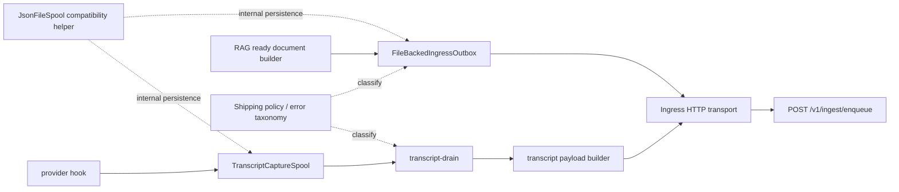
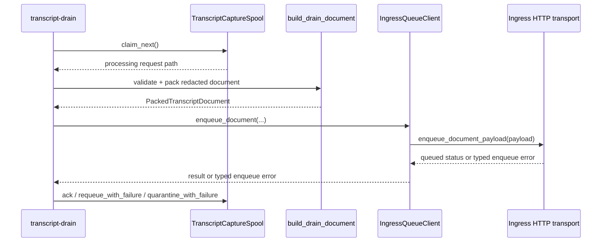
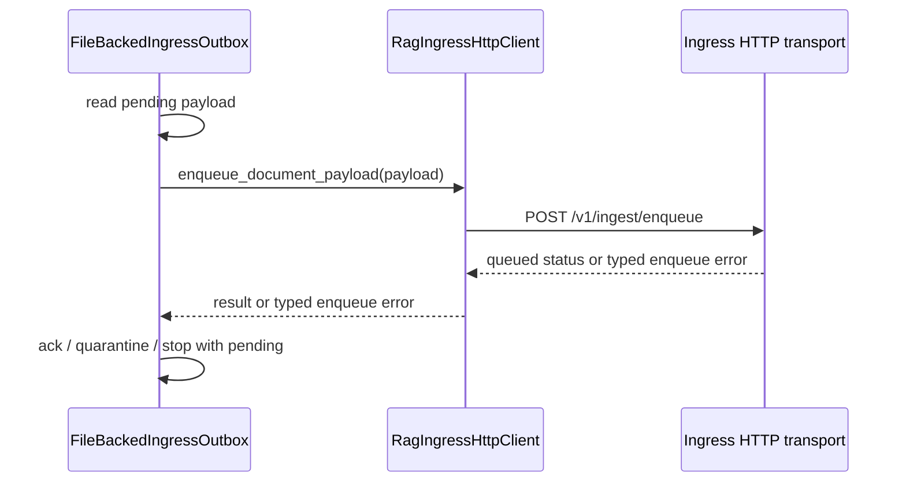

# Spool Pipeline Refactor Design Spec

## Overview

`dendrite`의 local spool/pipeline을 domain-facing 상태 전이 API와 공통 전송 실패 분류로 정리한다. `provider hook -> locator-only spool -> thin shipper -> POST 18080` 경계, 기존 CLI/API, enqueue wire format은 유지한다.

## Requirements Reference

- Phase 1 source: `requirements.md`
- Preview companion: `requirements.html`
- 승인 상태: approved by user autopilot directive
- 핵심 요구사항:
  - 파일 시스템 spool 세부사항은 domain wrapper 뒤로 숨긴다.
  - `TranscriptCaptureSpool`과 `FileBackedIngressOutbox`의 도메인 의미는 보존한다.
  - transcript drain과 RAG ingress outbox의 retry, quarantine, unreachable 의미를 같은 언어로 설명 가능하게 만든다.
  - full generic payload shipper는 만들지 않는다.
  - local runtime validation과 production-adjacent validation까지 완료한다.
  - production-adjacent validation의 기본 범위는 read-only audit와 local/fake-server synthetic smoke이며, live `POST` synthetic canary는 별도 승인 gate가 있을 때만 수행한다.

## Approach Proposal

### 선택안 A: Domain wrappers + internal persistence helper + shared shipping policy

추천 및 autopilot 선택안이다. `JsonFileSpool` import compatibility는 유지하되 새 구현/호출부는 domain wrapper와 shared policy를 통하게 한다. 전송 client 경계와 실패 분류는 공통화하지만 payload build는 각 도메인에 남긴다.

- 장점: 요구사항의 Candidate 1과 Candidate 3을 모두 만족하면서 wire format risk를 낮춘다.
- 단점: 완전한 중복 제거보다는 명시적 wrapper와 compatibility layer가 일부 남는다.

### 선택안 B: Minimal spool cleanup only

`Spool` inheritance 제거와 wrapper 정리만 수행한다.

- 장점: 작고 빠르다.
- 단점: transcript drain과 outbox 사이의 실패 taxonomy 불일치가 남아 이번 장기 goal의 production validation 기준을 약하게 만든다.

### 선택안 C: Full generic shipper

payload 생성, outbox, HTTP enqueue, drain까지 하나의 generic pipeline으로 흡수한다.

- 장점: 구조상 중복이 가장 적다.
- 단점: 요구사항의 non-goal을 침범하고 wire format 변경 위험이 크다.

## Architecture

### Module Boundaries

| Module | Role | Public compatibility |
| --- | --- | --- |
| `src/dendrite/spool.py` | JSON file persistence compatibility layer and legacy `Spool` facade | Keep `JsonFileSpool`, `Spool`, and existing method names import-compatible. Prefer composition for `Spool`. |
| `src/dendrite/transcript_capture.py` | Transcript capture domain spool | Keep locator-only request validation, status transitions, recoverable quarantine behavior. |
| `src/dendrite/transcript_drain.py` | Transcript drain orchestration and transcript payload build | Keep CLI/report fields and redaction guarantees. Use shared enqueue error taxonomy. |
| `src/dendrite/transcript_ingest.py` | Transcript enqueue payload builder and client facade | Keep `IngressQueueClient.enqueue_document` API and payload construction ownership. Delegate only transport/error mapping to common transport. |
| `src/dendrite/rag_ingress/outbox_client.py` | RAG ready outbox and compatibility exports | Keep `FileBackedIngressOutbox`, `RagIngressHttpClient`, structural `flush(client)` seam, and error imports. Move common pieces only if compatibility aliases remain. |
| New shared policy module | Error taxonomy and state decision helpers | Internal API only unless tests require imports through existing compatibility surfaces. |

## Data Flow

### Transcript Drain

### RAG Ingress Outbox

## Component Details

### Persistence Helper Compatibility

`JsonFileSpool` remains importable and behavior-compatible:

- creates `0700` root/subdirectories,
- writes `0600` JSON files through temp file + atomic link/replace,
- rejects symlink roots/subdirectories,
- validates managed paths and file names,
- exposes `write_json_once`, `replace_json`, `find_existing`, `files`, `claim_next`, `ack`, `quarantine`, `move_to`, `depth_counts`.

`Spool` should stop inheriting from `JsonFileSpool` and instead compose it, while preserving the public methods existing callers/tests can currently reach through inheritance. This removes the misleading "generic spool is a file spool subclass" shape without breaking imports.

`Spool` compatibility facade must preserve:

- `enqueue(event)`,
- `_find_existing(name)`,
- `write_json_once(...)`,
- `replace_json(...)`,
- `find_existing(name)`,
- `files(subdir)`,
- `claim_next(...)`,
- `ack(path)`,
- `quarantine(path)`,
- `move_to(path, subdir)`,
- `depth_counts()`,
- `root`, `subdirs`, and `root_label` attributes where existing code can observe them.

No inherited `Spool` surface is removed in this refactor unless `design.md` is updated first and a red compatibility test proves the intended break.

### Domain Spool APIs

`TranscriptCaptureSpool` remains the capture-domain owner of:

- `enqueue(request)`,
- `claim_next()`,
- `ack(path)`,
- `quarantine(path)`,
- `quarantine_with_failure(path, failure)`,
- `requeue_with_failure(path, failure)`,
- `requeue_recoverable_quarantine(...)`,
- `requeue_stale_processing(...)`,
- `depth_counts()`.

`FileBackedIngressOutbox` remains the RAG-ready outbox owner of:

- `enqueue(payload) -> OutboxItem`,
- `flush(client, limit=...) -> dict`,
- `depth_counts()`.

Low-level path movement stays behind these APIs. Tests may use compatibility helpers where existing behavior requires it, but production callers should not learn `pending/processing/acked/quarantine` file paths directly unless the method contract returns a path.

### Shared Ingress Transport

Create a small common transport/error surface that both transcript and outbox clients can use:

- validates `base_url` is `http` or `https`,
- rejects username/password credentials in `base_url`,
- posts JSON to `INGRESS_ENQUEUE_PATH`,
- maps client-owned payload validation failures to permanent rejected errors,
- maps network unreachable, timeout, HTTP 5xx, and invalid/unparseable ingress responses to retryable errors,
- maps HTTP 4xx and accepted=false responses to rejected/permanent only when they represent safe client payload rejection,
- returns normalized `{job_id, status}`.

Compatibility rule:

- `RagIngressHttpClient.enqueue_document_payload(payload)` remains available.
- `IngressQueueClient.enqueue_document(...)` remains available and continues to own transcript-specific payload build.
- Existing error class import paths from `dendrite.rag_ingress.outbox_client` keep working, even if the canonical implementation moves.
- `FileBackedIngressOutbox.flush(client)` remains structurally typed and does not require a concrete `RagIngressHttpClient`; tests and callers may keep passing compatible clients.

### Shared Shipping Policy

The shared policy is intentionally small. It does not decide how to build payloads and does not own server/brain behavior. It only classifies enqueue outcomes for local state transitions:

| Classification | Examples | Transcript drain action | Outbox action |
| --- | --- | --- | --- |
| `queued` | accepted response | `ack` | move to `acked` |
| `retryable` | unreachable, timeout, HTTP 5xx, invalid/unparseable ingress response | `requeue_with_failure`, stop current batch | leave in `pending`, stop current batch |
| `permanent` | client-owned payload validation error, safe HTTP 4xx payload rejection, safe accepted=false payload rejection | `quarantine_with_failure` | move to `quarantine` |

`transcript_drain` report fields remain stable: `status`, `last_status`, counts, `last_error_class`, `raw_locator_printed`, `raw_transcript_printed`. New internal typed errors should map back to the existing public error class strings such as `ingress_unreachable`, `ingress_rejected`, and `ingress_invalid_json`.

Compatibility note: current transcript drain behavior treats some ingress response failures as recoverable. M1 must characterize HTTP 4xx, HTTP 5xx, invalid/unparseable response JSON, accepted=false, and unreachable outcomes for both transcript drain and outbox before production code changes. Any intentional change from `retry_pending` to `quarantined` must be recorded in this design and covered by a red test before implementation.

### Retry And Quarantine Policy

Only client-owned payload validation failures are permanent by default. Network unreachable, timeout, HTTP 5xx, and invalid/unparseable ingress responses are retryable and stop the current batch. HTTP 4xx and `accepted=false` are rejected/permanent only when they represent safe client payload rejection.

Failure records should remain public-safe and include:

- `error_class`,
- `recoverable`,
- `retry_attempts`,
- `last_attempt_at`,
- optional `next_attempt_after`.

Repeated retryable failures must remain bounded and observable. Implementation must not create a hot loop across scheduled ticks. Existing `TranscriptCaptureSpool.requeue_recoverable_quarantine(...)` max-attempt behavior should be preserved or made more explicit, not weakened.

### Production-Adjacent Validation Boundary

M6 default completion is fail-closed: read-only operational audit plus local/fake-server synthetic smoke only. A live `POST /v1/ingest/enqueue` is not part of the default gate unless a separate approval gate names an approved synthetic canary endpoint, target profile, payload shape, and rollback/no-retention expectation.

Real provider session generation, real production enqueue/ship, private runtime locator access, `RAGFLOW_API_KEY` handling, SSH, Docker, GC, or server/brain mutation remain out of scope for `dendrite`.

M6 evidence must state separately:

- what was read-only audit,
- what was local synthetic smoke,
- whether any live `POST` was skipped or explicitly approved,
- that no raw transcript, private locator, token, credential, raw `dataset_id`, or raw `document_id` was printed.

## Error Handling

- Raw source read failures, unsupported capture requests, or validation errors are permanent for the current item and go to quarantine.
- Network unreachable, timeout, or server-side HTTP 5xx are retryable and stop the batch to avoid rapid repeated failures.
- Invalid/unparseable ingress responses are retryable because they may indicate server-side or proxy instability rather than a client-owned bad payload.
- HTTP 4xx and accepted=false are permanent only when the response safely identifies a client-owned payload rejection.
- Invalid local payload shape is permanent for the current item.
- Duplicate enqueue requests remain idempotent through existing filename/content-hash behavior.
- No error path may print raw transcript body, private locator, token, credential, raw `dataset_id`, raw `document_id`, or `RAGFLOW_API_KEY`.
- If implementation discovers that these classifications would change the approved requirements, work stops and regresses to `grill-to-spec` Phase 1/2 instead of silently changing SoT.

## Testing Strategy

Use `harnesskit-tdd` red-green-refactor discipline for every implementation milestone:

- Write or extend behavior tests before production code.
- Confirm the targeted new/changed tests fail for the intended reason.
- Implement the smallest change that passes.
- Run the focused tests, then the broader gate.
- Do not add skip/xfail to pass.

Primary test layers:

- Unit/behavior tests for `JsonFileSpool` compatibility and `Spool` composition behavior.
- Direct `Spool` compatibility tests for public methods currently reachable through inheritance.
- Domain tests for `TranscriptCaptureSpool` state transitions and recoverable quarantine.
- Transport tests for credential rejection, 4xx/5xx/unreachable/invalid JSON/accepted=false classification.
- Drain/outbox integration tests using temp spools and fake HTTP responders.
- Boundary tests proving forbidden server/brain/GC/RAGFlow credential ownership does not appear, including `RAGFLOW_API_KEY`, SSH, Docker/RAGFlow management, GC scheduler wiring, and direct RAGFlow mutation strings.
- CLI/runtime smoke tests proving reports are redacted and the boundary output is unchanged.

## Milestones

Requirements L0-L3 are verification gates; M0-M7 are implementation milestones. Each milestone contributes evidence to one or more gates:

| Milestone | Primary verification gate |
| --- | --- |
| M0 | Design/review readiness before implementation |
| M1 | L1 red-test characterization |
| M2 | L1 focused spool/capture behavior |
| M3 | L1 focused transport/client behavior |
| M4 | L1 focused drain/outbox policy behavior |
| M5 | L0, L1, L2 local verification |
| M6 | L3 production-adjacent verification |
| M7 | Final cleanup and merge readiness |

### M0: Spec and Review Gate

Done when:

- `requirements.md` and `design.md` exist in `specs/spool-pipeline-refactor/`.
- `codebase_architecture_manager` and `system_architecture_manager` have reviewed `design.md`.
- Review feedback has either been incorporated or explicitly rejected with rationale in this design.

Evidence:

- Reviewer summaries.
- `git diff -- specs/spool-pipeline-refactor/requirements.md specs/spool-pipeline-refactor/design.md`.

### M1: Characterization and Red Tests

Done when behavior tests describe the desired refactor seams before implementation:

- `Spool` public behavior remains compatible while no production caller needs subclass internals.
- Direct `Spool` compatibility tests cover `enqueue`, `_find_existing`, `write_json_once`, `replace_json`, `find_existing`, `files`, `claim_next`, `ack`, `quarantine`, `move_to`, `depth_counts`, and observable root/subdir attributes.
- `IngressQueueClient` and `RagIngressHttpClient` classify enqueue failures consistently.
- Characterization tests cover HTTP 4xx, HTTP 5xx, invalid/unparseable response JSON, accepted=false, and unreachable outcomes.
- Transcript drain and outbox preserve current report/state semantics under queued, retryable, and permanent outcomes.
- Boundary tests still guard forbidden ownership strings.

Evidence:

- Focused red test output for the newly introduced expectations.

### M2: Persistence and Domain Spool Refactor

Done when:

- `Spool` composes `JsonFileSpool` instead of inheriting from it.
- `JsonFileSpool` is documented in code/docstrings or local comments as compatibility/internal persistence helper.
- Domain wrappers retain their public APIs and validation behavior.
- Existing spool and capture tests pass.

Evidence:

- Focused tests: `uv run pytest -q tests/test_spool.py` and capture-related tests.

### M3: Shared Ingress Transport and Error Taxonomy

Done when:

- Transcript and outbox clients share one transport/error mapping implementation.
- Existing import paths for outbox errors remain compatible.
- `IngressQueueClient.enqueue_document` still builds the same payload shape.
- `RagIngressHttpClient.enqueue_document_payload` still accepts the same payload shape.
- `IngressQueueClient` validates base URL scheme and credentials consistently with the shared transport, with compatibility tests covering CLI/report expectations.
- Failure records include safe `error_class`, `recoverable`, `retry_attempts`, `last_attempt_at`, and optional `next_attempt_after` where the domain persists failure metadata.

Evidence:

- Focused tests for transcript ingest queue client and RAG ingress outbox client.

### M4: Shipping Policy Alignment

Done when:

- Transcript drain and RAG ingress outbox use the same classification language for queued/retryable/permanent outcomes.
- Retryable network, timeout, HTTP 5xx, and invalid/unparseable response failures leave work retryable and stop the batch.
- Permanent failures quarantine the current item.
- Success cases are acked or queued as appropriate.
- Retry behavior remains bounded and observable; scheduled ticks must not hot-loop the same failing item without attempt metadata.

Evidence:

- Focused tests for `tests/test_transcript_drain.py` and `tests/test_rag_ingress_outbox_client.py`.

### M5: Full Local Verification

Done when:

- `uv run pytest -q` passes.
- `uv run python -m dendrite --show-boundary` prints exactly `provider hook -> locator-only spool -> thin shipper -> POST 18080`.
- Local runtime smoke exercises capture, migrate dry-run, and drain with a fake/synthetic endpoint.
- JSON reports show `raw_locator_printed=false` and `raw_transcript_printed=false` where applicable.

Evidence:

- Command outputs with secrets/private locators redacted.

### M6: Production-Adjacent Verification

Done when:

- Read-only production-adjacent audit confirms the `dendrite` local client surface without mutating Ubuntu/RAGFlow/server state.
- Local/fake-server synthetic smoke proves the refactored client path without raw/private operational data.
- Live `POST /v1/ingest/enqueue` synthetic canary is skipped unless a separate approval gate names the approved canary endpoint, target profile, payload shape, and rollback/no-retention expectation.
- Real provider session generation, real production enqueue/ship, private runtime locator access, SSH, Docker, RAGFlow credential handling, GC, or server/brain mutation is not performed.

Evidence:

- Redacted audit/smoke command transcript.
- Clear statement of what was read-only audit, what was local synthetic smoke, whether live `POST` was skipped or separately approved, and what was synthetic versus real.

### M7: Final Review and Cleanup

Done when:

- Worktree contains only intended tracked changes and approved generated artifacts.
- No unrelated user/runtime changes are reverted.
- Review findings from implementation are resolved or documented.
- Merge readiness is stated with test/runtime/production-adjacent evidence.

Evidence:

- `git status --short --branch`.
- Final test and validation summary.

## Open Questions

- None for the base implementation scope.
- Separate approval is required only for live `POST /v1/ingest/enqueue` synthetic canary, real provider session generation, real production enqueue/ship, or private runtime locator access. If that approval is not granted, M6 completes with read-only audit plus local/fake-server synthetic smoke.

## Review Feedback Log

- `codebase_architecture_manager`: approve-with-changes. Reflected by tightening failure taxonomy characterization, `Spool` facade compatibility, structural outbox client seam, and M6 production-adjacent boundary.
- `system_architecture_manager`: approve-with-changes. Reflected by narrowing M6 default completion, making live `POST` canary separately gated, changing invalid/unparseable ingress responses to retryable, and adding bounded retry metadata.
- `gpt-5.3-codex-spark` scout: approve-with-changes. Reflected by adding L0-L3/M0-M7 mapping, direct `Spool` compatibility red tests, public API watchlist coverage, and 4xx/5xx/invalid/accepted=false characterization.
